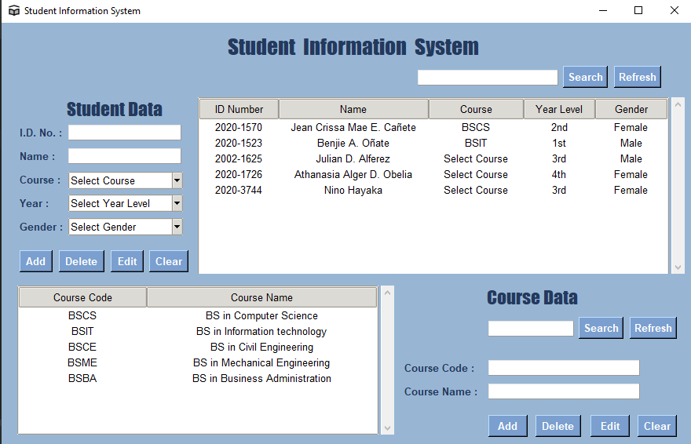

# Simple-Student-Information-System
## *by Jean Crissa Mae E. Cañete*

A Python-based GUI program made with Tkinter utilizing SQLite database
to manage student data with the following features:

- Displays the list of students
- Add a student
- Edit a student
- Delete a student
- Search a student 

### Output:

